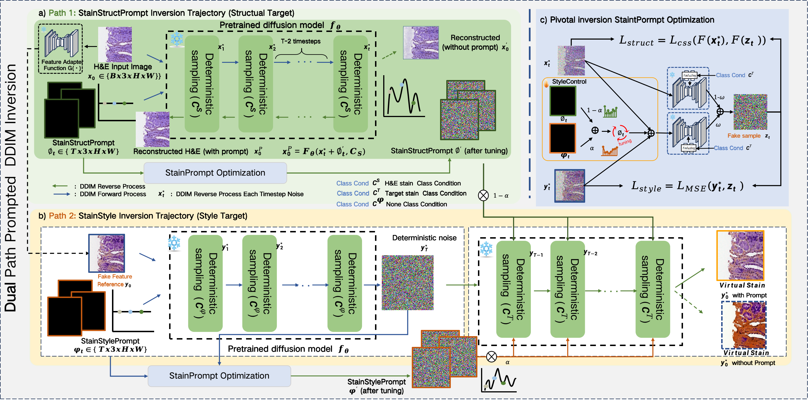

# StainPromptInversion: Unpaired Multi-Domain Histopathology Virtual Staining using Dual Path Prompted Inversion

**Official implementation of "Unpaired Multi-Domain Histopathology Virtual Staining using Dual Path Prompted Inversion"**

👨‍💻:Bing Xiong, Yue Peng, RanRan Zhang, Fuqiang Chen, JiaYe He, Wenjian Qin.

1.ShenZhen Institue of Advanced Technology
2.University of Chinese Academy of Sciences



## 🤳 News:
+ 🎊🎊Congratulations! Our paper is accepted by

## 📑 Prepare for Dataset and Enviroment

### 1. Enviroment

```
conda env create -f environment.yaml
conda activate nvpdiff
```

### 2. Download Processed Dataset

1. BaiduNetDiskDownload: 
```
 https://pan.baidu.com/s/1WEokxDFFvWO-NiqnXb6KcQ?pwd=hepm  提取码: hepm 

```

2. GoogleDrive

```
https://drive.google.com/file/d/1b3pY6DryQdMDl934keb1vuFg-jE3Iamf/view?usp=drive_link 
```

### 3. Download Pretrained Weight
```
modelxxxx.pt represent pretrained diffusion model. ANHIR_params_lastest.pt represent UMDST pretrained weight. lastest_net_G_A.pt represent Cyclegan pretrained weight.
```

1. BaiduNetDiskDownload: 
```
https://pan.baidu.com/s/15CSVbS0pSYwvnmNyCTknuA?pwd=mtqu 提取码: mtqu 
```

2.GoolgeDriven
```
https://drive.google.com/drive/folders/1lpbfL9xZmIHoVwql5PTYD4eJztGMV6Po?usp=drive_link
```

# Training Your own model

**Our method is a training-free method. If you want to training on your own dataset, you can following the stage.**

## 1. pretrained diffusion model

**Attention**: When you use improved-diffusion to pretrained diffusion model, you shoud set --rescale_timesteps True

You can pretrain your own diffusion model in this repo: [improved diffusion](https://github.com/openai/improved-diffusion) and [guided diffusion](https://github.com/openai/guided-diffusion)

## 2. pretrained GAN model
Our Method based on [Cyclegan](https://github.com/junyanz/CycleGAN) and [UMDST(AAAI'22)](https://github.com/linyiyang98/UMDST). If you want to pretrain your own GAN, please follow the two repo ReadME.md file. It is clear and easy to follow.

# Test/Inference

```
bash scripts/stain2stain_sample.sh
```
**Key Code in the file(guided_diffusion/gaussian_diffusion.py  line 911-line 985). Our Method is Simple and Useful**


# Evaluate Metrics📈


# Disscussion📰
```
We tested the effect of modifying the sampling condition variables on the results, and in most cases, selecting the condition corresponding to HE during the forward process of inputting HE images and transferring the staining to the target domain showed better results. However, under some parameters, consistently using the condition variables corresponding to HE showed better results. We look forward to implementing the visual stain prompt optimization strategy in this article in a faster way. If this repo is helpful to you, please star✨ and cite us! Thanks!
```

## BibTex
**If this repo is helpful to you, please cite us.**
```
@misc{ anonymous2024unpaired, title={Unpaired Multi-Domain Histopathology Virtual Staining using Dual Path Prompted Inversion}, author={Anonymous}, year={2024}, url={https://openreview.net/forum?id=sgUd6Lb59G} }


```

## Acknowledgement

**This repo is built upon [improved diffusion](https://github.com/openai/improved-diffusion) and [guided diffusion](https://github.com/openai/guided-diffusion), dataset [ANHIR](https://anhir.grand-challenge.org/) . Thanks for their amazing work and contribution !**